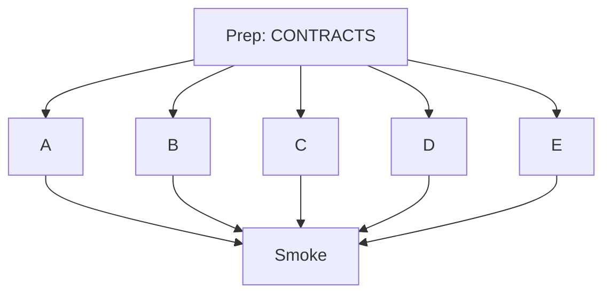

# Agent Kickoff — Opik Onboarding Tool

This is the PRD and operating protocol for cloud agents building `97115104/opik-onboarding-tool`. Read this file, [ARCHITECTURE.md](./ARCHITECTURE.md), and [CONTRACTS.md](./CONTRACTS.md) before touching code.

## Product summary

**One command for contributors:**

```bash
git clone https://github.com/97115104/opik-onboarding-tool.git
cd opik-onboarding-tool
./deploy-locally.sh
```

Manual steps only: sudo for package installs, GitHub device-code paste, Docker Desktop on Mac.

The tool deploys Opik + Ollama + demo UIs, walks an onboarding wizard, assigns a ranked Opik GitHub issue, and emits a Cursor prompt with an Opik-repo branch `opik-onboarding-tool-97115104-contribution-{N}`.

**Out of scope:** Opening a PR against Opik from this repo.

## Engineering method (Bun-style loop)

Inspired by [Rewriting Bun in Rust](https://bun.com/blog/bun-in-rust):

```
task → implement → 2 adversarial reviews → fix → close → smoke
```

The **task queue is GitHub Issues** — not overlapping agents on the same files.

When a class of failure repeats, fix the **process** (edit this file or CONTRACTS via a new Prep/fix issue), not only the code.

## Issue protocol

### Roles

| Label | Role |
|-------|------|
| `workstream:prep` | Contracts + architecture |
| `workstream:A`–`E` | Implementers (disjoint paths) |
| `workstream:review` | Adversarial reviewer (read-only) |
| `workstream:fix` | Applies review feedback |
| `workstream:smoke` | Full deploy + Playwright gate |

### Claiming work

1. Find your issue: `gh issue list --repo 97115104/opik-onboarding-tool --label "workstream:A"`
2. Comment: `claimed — <cloud agent URL or local session>`
3. Implement **only** paths listed under **Owned paths** in the issue body
4. Comment completion summary + file list; **leave open** until reviews pass
5. Close only when: done + both reviews addressed + no blocking review items

### Review protocol

- Two review issues per implement issue (`Review: adversarial pass 1/2 for #N`)
- Reviewers receive: git diff, CONTRACTS, parent issue body
- **Do not** trust implementer reasoning — assume it is wrong
- Post findings as issue comments with severity: `blocker`, `major`, `minor`
- Reviewers **do not edit product code**

### Fix protocol

- Fixer works from review findings on the parent implement issue or linked `Fix: apply review feedback for #N`
- Touches same owned paths as parent only
- Responds to each finding; re-request review by commenting on review issues

### Git rules

- **No** `git stash`, `git reset --hard`, or broad destructive resets
- Commit to `main` on this repo with path discipline (or commits referencing `Fixes #N`)
- **Never** two open implement issues editing the same file
- No feature branches on this repo

### Path discipline

Exclusive ownership is in [CONTRACTS.md](./CONTRACTS.md). If you need a contract change, stop and open a Prep/fix issue — do not silently edit shared files.

## Workstream dependency graph



- **Prep** must close before A–E start
- **A–E** may run in parallel after Prep closes
- **Smoke** runs only after A–E are closed

### Workstream summary

| Issue | Delivers |
|-------|----------|
| **Prep** | ARCHITECTURE.md, CONTRACTS.md, AGENT_KICKOFF.md |
| **A** | deploy-locally.sh, scripts/* (except C scripts), apps/chat-demo |
| **B** | onboarding UI shell, design, overview/graph/tour/stack/extend |
| **C** | quiz, issues, Cursor prompt, PR checklist, rank/branch scripts |
| **D** | README, CONTRIBUTING, content/, docs/ |
| **E** | e2e/, run-e2e.sh |
| **Smoke** | `./deploy-locally.sh` green + Playwright pass |

## Agent prompt template

Copy into each cloud agent launch:

```
You own GitHub issue #N ONLY on 97115104/opik-onboarding-tool.

Before coding:
1. Read the issue body Owned paths — refuse all other paths.
2. Read AGENT_KICKOFF.md, ARCHITECTURE.md, CONTRACTS.md on main.

While working:
- Comment progress on issue #N.
- No destructive git operations.
- No paragraph-long workarounds — fix the code.

When done:
- Comment completion summary + changed file list.
- Leave issue open for review.
- Do NOT self-review.

Acceptance: meet every checkbox in the issue body.
```

For reviewers:

```
You own review issue #R for implement issue #N (read-only).

Read: git diff for #N, CONTRACTS.md, parent issue #N.
Do NOT edit product code.
Post adversarial findings on issue #R with blocker/major/minor.
Assume the implementation is wrong until proven otherwise.
```

## Orchestrator commands

Monitor board:

```bash
gh issue list --repo 97115104/opik-onboarding-tool \
  --label "workstream:prep,workstream:A,workstream:B,workstream:C,workstream:D,workstream:E,workstream:smoke" \
  --state open
```

On smoke failure, open fix issues labeled `workstream:fix` + parent workstream label, referencing the failing spec.

## Success criteria (project complete)

- [ ] `./deploy-locally.sh` one-shot works (Bun, gh auth, Opik, Ollama, UIs, e2e, browsers)
- [ ] Playwright suite passes in deploy and smoke
- [ ] Wizard covers steps 1,2,6–8,10,11 with Cursor-like UI
- [ ] Quiz + assignment produces Cursor prompt + branch `opik-onboarding-tool-97115104-contribution-N`
- [ ] Every implement issue closed with two addressed review passes
- [ ] Issue board shows Prep → A–E → Smoke with no path conflicts

## UI direction

Reference: [cursor.com/home](https://cursor.com/home)

- Single composition, first viewport
- Expressive typography (not Inter/Roboto)
- Atmospheric background (subtle gradient/pattern)
- One job per step; 2–3 intentional motion transitions
- No card soup in hero

## Seeded issues

Created by orchestrator on plan approval. Review issues are added when each implement issue reaches "ready for review."

Issue numbers are referenced in GitHub — run `gh issue list --repo 97115104/opik-onboarding-tool` for current IDs.

---

*Contract version 1.0.0 — Prep workstream*
