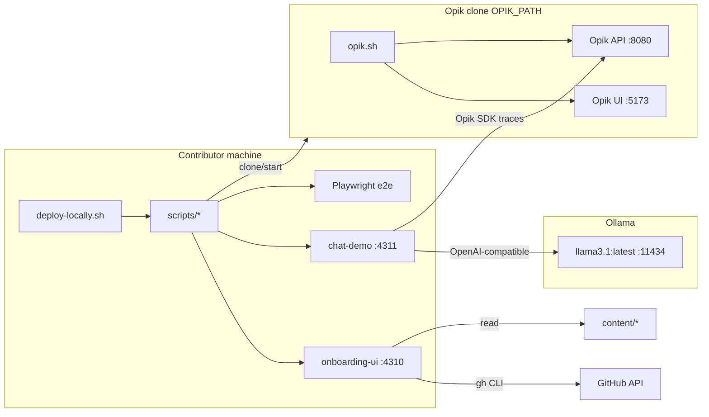

# Architecture — Opik Onboarding Tool

This document describes how the onboarding tool is structured, how services connect, and how cloud agents implement it without path conflicts.

## Purpose

The **Opik Onboarding Tool** guides a contributor from zero to a first Opik contribution. It:

1. Deploys a local Opik stack (Docker via `opik.sh`), Ollama, and demo UIs.
2. Walks the user through product knowledge (overview, Opik Features, Try Opik, quiz) and Opik contribution norms (contributing overview + contributing quiz).
3. Assigns a ranked GitHub issue from `comet-ml/opik` and generates a Cursor prompt + contribution branch on the **Opik repo** (not this repo).
4. Provides Verify (local checks / CI awareness) and PR help (draft PR Cursor prompt) aligned with Opik's CONTRIBUTING.md.

This repo does **not** open Opik PRs in the initial pass — it prepares the contributor.

## High-level topology



## Repository layout

```
opik-onboarding-tool/
  deploy-locally.sh          # One-shot entrypoint
  scripts/                   # Bash orchestration (Bun for JS apps only)
  apps/
    onboarding-ui/           # Vite + React + TS + Tailwind wizard
    chat-demo/               # Ollama chat with Opik instrumentation
  e2e/                       # Playwright acceptance suite
  content/                   # Markdown/JSON consumed by UI
  docs/audiences/            # Role-specific guides
```

See [CONTRACTS.md](./CONTRACTS.md) for ports, env vars, path ownership, and API contracts.

## Technology choices

| Layer | Choice | Rationale |
|-------|--------|-----------|
| JS toolchain | Bun 1.1+ | Fast install/run; `bunx playwright` for e2e |
| UI apps | Vite + React + TS + Tailwind | Standard, fast dev server |
| OS orchestration | Bash | sudo, Docker, gh, Ollama, Opik lifecycle |
| E2E | Playwright | Headless gate in deploy + agent smoke |
| Issue ranking | `gh` CLI | No extra GitHub token plumbing in UI |

## Deploy flow (`deploy-locally.sh`)

Sequential phases (see CONTRACTS for flags):

1. **install-deps.sh** — Bun, Docker, gh, Ollama, Playwright OS deps
2. **ensure-gh-auth.sh** — Block until `gh auth status` succeeds
3. **clone-opik.sh** — Ensure `OPIK_PATH` is a valid Opik checkout
4. **ensure-ollama.sh** — Serve + pull `llama3.1:latest`
5. **start-opik.sh** — `./opik.sh`, poll health
6. **start-chat-demo.sh** + **verify-opik-wiring.sh**
7. **start-onboarding-ui.sh**
8. **run-e2e.sh** — Fail deploy on red (unless `--skip-e2e`)
9. **open-browsers.sh** — Open all service URLs (skip with `--noninteractive`)

## Onboarding UI wizard

Single-page wizard with light (white/black) aesthetic. Steps:

| Step | Route key | Data source | Owner |
|------|-----------|-------------|-------|
| About you | `about` | Persona choice (localStorage) | B |
| Overview | `overview` | `overviewSlides.ts` (+ `content/overview.md`) | B |
| Opik Features | `graph` | `content/knowledge-graph.json` | B |
| Local stack | `stack` | Same-origin `/api/health/:service` | B |
| Try Opik | `tour` | `TourStep.tsx` (`TOUR_ITEMS`; `content/onboarding-tour.md` prose mirror) | B |
| Quiz | `quiz` | `content/quiz.json` (auto-grade) | C |
| Contributing overview | `contributing-overview` | `contributingSlides.ts` (+ `content/contributing-overview.md`) | C |
| Contributing quiz | `contributing-quiz` | `content/contributing-quiz.json` (auto-grade) | C |
| Issues | `issues` | `scripts/rank-issues.sh` + persona | C |
| Cursor prompt | `prompt` | Generated + open-Cursor command | C |
| Verify | `verify` | Area plan + checklist | C |
| PR help | `pr-help` | Secondary Cursor prompt | C |
| Extend | `extend` | CONTRIBUTING.md link | B |
| Finish | `finish` | Celebration | B |

Shell, routing, design system, About you, health proxy, and non-C steps → **workstream B**.  
Quiz, contributing quiz, issues, Cursor prompts, verify, and PR-help → **workstream C** under `src/features/`. Contributing overview (owner C) lives in `src/steps/ContributingOverviewStep.tsx` with slides in `src/content/contributingSlides.ts`.

## Chat demo

Minimal OpenAI-compatible chat UI:

- Backend: Ollama at `http://localhost:11434`
- Tracing: Opik TypeScript SDK → local Opik API
- Started by `scripts/start-chat-demo.sh`, verified by `verify-opik-wiring.sh`

Owned by **workstream A** (`apps/chat-demo/**` + related scripts).

## Contribution branch (Opik repo only)

Pattern: `{username}/{ticket}-{summary}` (Opik CONTRIBUTING)

`scripts/create-contribution-branch.sh` (workstream C):

1. `cd "$OPIK_PATH"`
2. Resolve `username` from `CONTRIBUTOR_ID` if set, else authenticated `gh` login
3. With `--issue NUMBER`: ticket = `issue-{NUMBER}`; without: ticket = `NA`
4. Summary from `--summary` (slugified; default `onboarding`)
5. `git fetch origin main && git checkout -b <branch> origin/main` (or checkout if the branch already exists locally)
6. Print branch name for UI + Cursor prompt

No commits required in this pass — branch creation only.

## Cloud agent workstreams

Implementation is sharded via GitHub Issues on `97115104/opik-onboarding-tool`. Each open implement issue owns exclusive paths (see CONTRACTS). Process:

```
Prep → 2 adversarial reviews → fix → close Prep
  → parallel A, B, C, D, E (each: implement → 2 reviews → fix → close)
  → Smoke (full deploy + Playwright)
```

Details in [AGENT_KICKOFF.md](./AGENT_KICKOFF.md).

## External dependencies

| Dependency | Version / note |
|------------|----------------|
| Opik | Cloned from `https://github.com/comet-ml/opik` |
| Ollama model | `llama3.1:latest` |
| Bun | 1.1+ (installed by deploy if missing) |
| Docker | Required for Opik stack |
| GitHub CLI | Authenticated for issue ranking |

## Security notes

- Never commit secrets; gh uses existing auth
- Sudo only in `install-deps.sh` for package installs
- `OPIK_PATH` must not be destroyed by clone script (fetch only if present)
